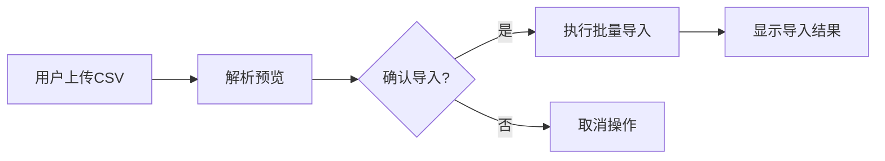

# 动画设定资料收藏索引系统 - 产品需求文档

## 1. 产品概述
动画设定资料收藏索引系统是一款面向动画爱好者和收藏者的本地资料管理工具，帮助用户系统化地管理原画集、分镜集、设定集等各类动画相关资料。
- 解决收藏资料难以检索、分类混乱的痛点，支持多维度检索和关联管理
- 目标用户：动画爱好者、资料收藏者、动画从业者

## 2. 核心功能

### 2.1 用户角色
| 角色 | 注册方式 | 核心权限 |
|------|----------|----------|
| 普通用户 | 无需注册（本地使用） | 录入、编辑、检索、导入导出所有功能 |

### 2.2 功能模块
1. **资料管理页面**：资料列表展示、添加/编辑/删除资料、批量操作
2. **高级检索页面**：多维度筛选检索、结果展示
3. **导入导出页面**：CSV批量导入、CSV导出、导入预览
4. **标签管理**：作品、角色、制作人员标签的维护

### 2.3 页面详情
| 页面名称 | 模块名称 | 功能描述 |
|----------|----------|----------|
| 资料管理 | 资料列表 | 卡片式展示资料，支持分页和排序 |
| 资料管理 | 添加/编辑表单 | 录入资料详细信息，支持多标签关联 |
| 高级检索 | 筛选面板 | 按作品、角色、原画师、资料类型、年代筛选 |
| 高级检索 | 结果展示 | 检索结果列表，支持快速查看详情 |
| 导入导出 | 导入功能 | 解析CSV文件，预览数据，批量导入 |
| 导入导出 | 导出功能 | 选择导出字段，导出全部或筛选结果 |
| 标签管理 | 标签列表 | 管理作品、角色、制作人员标签库 |

## 3. 核心流程

### 3.1 资料录入流程
用户添加新资料 → 填写基本信息 → 关联作品/角色/制作人员 → 保存到本地存储

### 3.2 检索流程
用户进入检索页面 → 设置筛选条件 → 执行检索 → 查看结果 → 查看详情

### 3.3 CSV导入流程
用户选择CSV文件 → 系统解析预览 → 确认字段映射 → 执行导入 → 显示导入结果

## 4. 用户界面设计

### 4.1 设计风格
- **主色调**：深靛蓝 (#1e3a5f) - 传达专业、收藏的厚重感
- **辅助色**：琥珀金 (#d4a574) - 体现珍贵资料的质感
- **背景**：深蓝灰色调渐变，营造图书馆/档案馆氛围
- **按钮风格**：圆角矩形，悬停时有精致的阴影和颜色过渡
- **字体**：标题使用思源宋体（Serif），正文使用思源黑体（Sans-serif）
- **布局风格**：卡片式布局，左侧导航，主内容区网格展示
- **图标风格**：线性图标，简洁优雅

### 4.2 页面设计概述
| 页面名称 | 模块名称 | UI元素 |
|----------|----------|--------|
| 资料管理 | 资料列表 | 卡片网格，悬停动效，筛选工具栏 |
| 资料管理 | 表单弹窗 | 分区表单，标签选择器，页码范围控件 |
| 高级检索 | 筛选面板 | 多列筛选布局，动态标签选择，年代滑块 |
| 导入导出 | 导入预览 | 表格预览，字段映射下拉，进度指示 |

### 4.3 响应式
- 桌面端优先（1280px+），主内容区采用3-4列卡片网格
- 平板端（768-1280px）：2列卡片，导航可折叠
- 移动端（<768px）：单列布局，底部导航
- 触摸优化：按钮最小48px，适当增加触摸间距

### 4.4 视觉细节
- 卡片添加精致的内阴影和边框，模拟实体书籍质感
- 页面加载时采用淡入和轻微上浮的动画效果
- 悬停状态有微妙的缩放和阴影变化
- 背景添加细微的噪点纹理，增加复古质感
