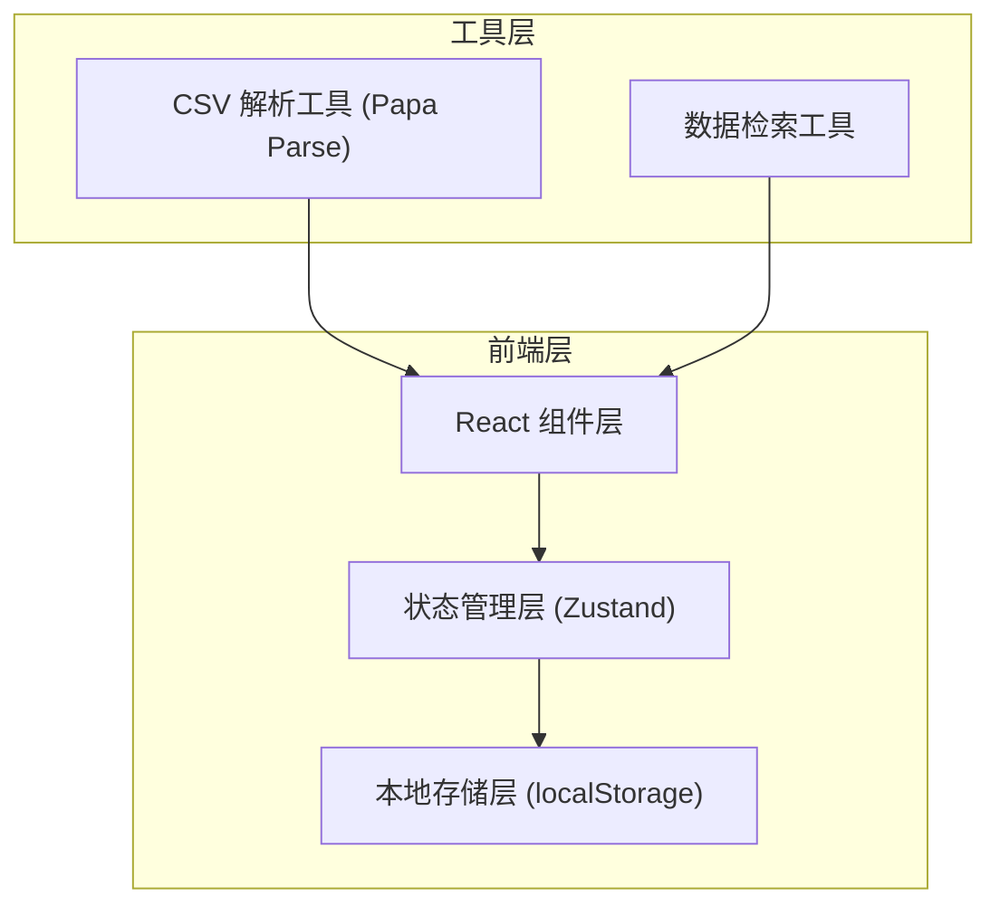
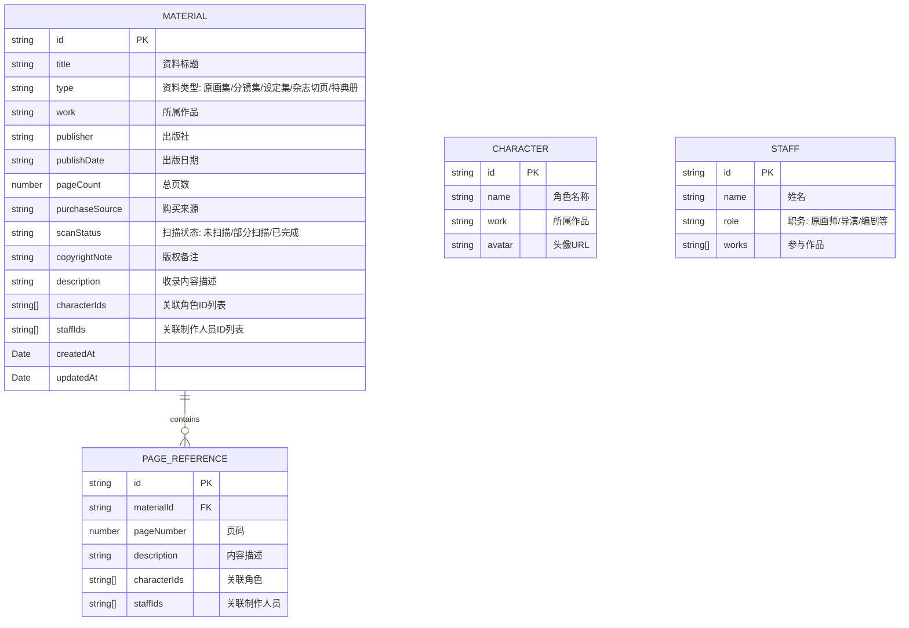

# 动画设定资料收藏索引系统 - 技术架构文档

## 1. 架构设计



## 2. 技术描述
- **前端框架**: React@18 + TypeScript
- **构建工具**: Vite@5
- **样式方案**: TailwindCSS@3
- **状态管理**: Zustand
- **CSV处理**: Papa Parse
- **图标库**: Lucide React
- **数据存储**: localStorage (本地浏览器存储)

## 3. 路由定义
| 路由 | 页面组件 | 用途 |
|------|----------|------|
| / | Dashboard | 首页概览，资料统计 |
| /materials | MaterialList | 资料列表管理 |
| /materials/:id | MaterialDetail | 资料详情 |
| /search | AdvancedSearch | 高级检索 |
| /import-export | ImportExport | CSV导入导出 |
| /tags | TagManagement | 标签管理 |

## 4. 数据模型

### 4.1 数据模型定义



### 4.2 TypeScript 类型定义

```typescript
type MaterialType = 'artbook' | 'storyboard' | 'setting' | 'magazine' | 'special';
type ScanStatus = 'unscanned' | 'partial' | 'completed';

interface Material {
  id: string;
  title: string;
  type: MaterialType;
  work: string;
  publisher: string;
  publishDate: string;
  pageCount: number;
  purchaseSource: string;
  scanStatus: ScanStatus;
  copyrightNote: string;
  description: string;
  characterIds: string[];
  staffIds: string[];
  pageReferences: PageReference[];
  createdAt: string;
  updatedAt: string;
}

interface Character {
  id: string;
  name: string;
  work: string;
}

interface Staff {
  id: string;
  name: string;
  role: string;
  works: string[];
}

interface PageReference {
  id: string;
  pageNumber: number;
  description: string;
  characterIds: string[];
  staffIds: string[];
}

interface SearchFilters {
  work?: string;
  characterId?: string;
  staffId?: string;
  staffRole?: string;
  type?: MaterialType;
  yearFrom?: number;
  yearTo?: number;
  keyword?: string;
}
```

## 5. 状态管理设计

### Store 结构
```typescript
interface AppState {
  materials: Material[];
  characters: Character[];
  staff: Staff[];
  
  // Actions
  addMaterial: (material: Omit<Material, 'id' | 'createdAt' | 'updatedAt'>) => void;
  updateMaterial: (id: string, updates: Partial<Material>) => void;
  deleteMaterial: (id: string) => void;
  searchMaterials: (filters: SearchFilters) => Material[];
  
  addCharacter: (character: Omit<Character, 'id'>) => void;
  addStaff: (staff: Omit<Staff, 'id'>) => void;
  
  importFromCSV: (data: any[]) => { success: number; failed: number };
  exportToCSV: (materialIds?: string[]) => string;
  
  loadFromStorage: () => void;
  saveToStorage: () => void;
}
```

## 6. 核心工具函数

### 6.1 CSV 处理
- **parseCSV**: 使用 Papa Parse 解析上传的 CSV 文件
- **validateImportData**: 验证导入数据格式和必填字段
- **generateCSV**: 将资料数据转换为 CSV 格式字符串

### 6.2 检索引擎
- **filterByWork**: 按作品名称筛选
- **filterByCharacter**: 按关联角色筛选
- **filterByStaff**: 按制作人员筛选
- **filterByType**: 按资料类型筛选
- **filterByYear**: 按年代范围筛选
- **fuzzySearch**: 关键词模糊搜索

### 6.3 本地存储
- **storageKey**: 'animation-material-collection'
- **serializeData**: 序列化数据为 JSON 字符串
- **deserializeData**: 反序列化 JSON 字符串为对象
- **autoSave**: 数据变更后自动保存
